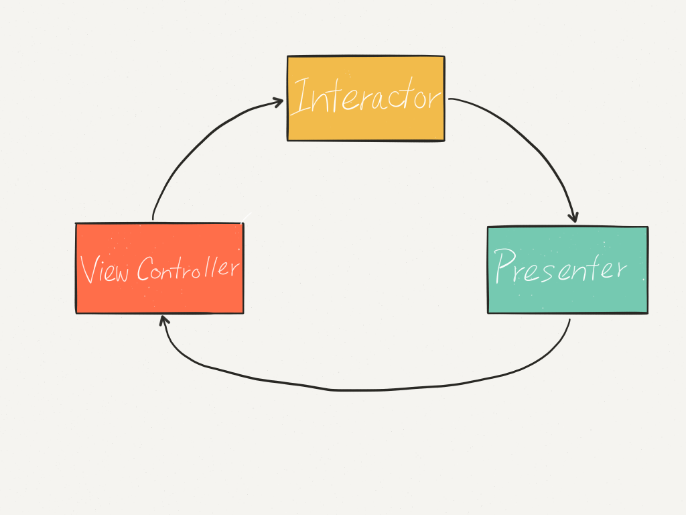
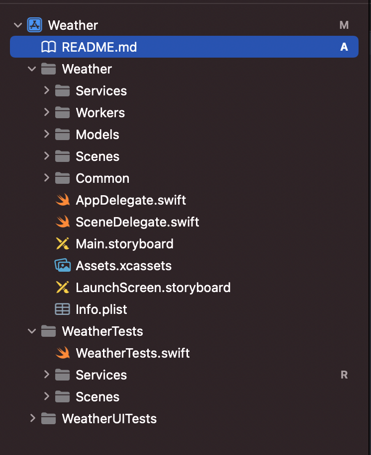
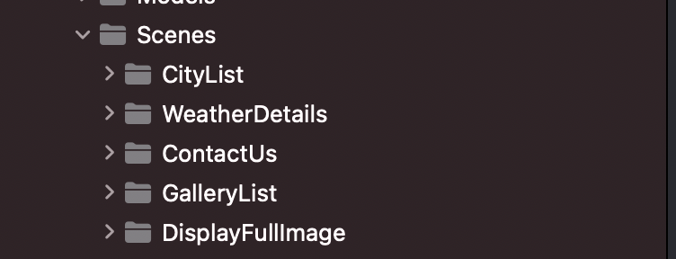
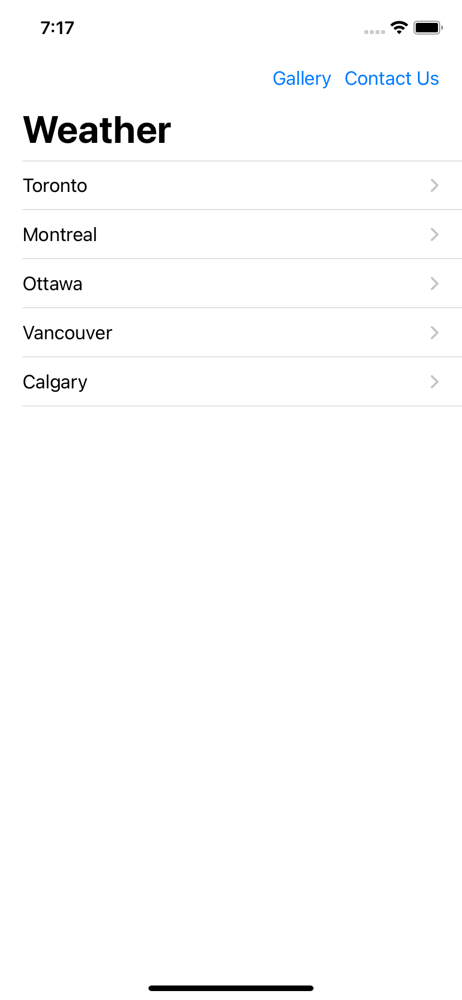
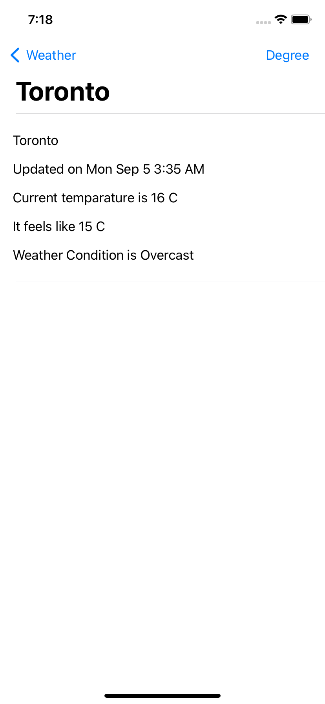
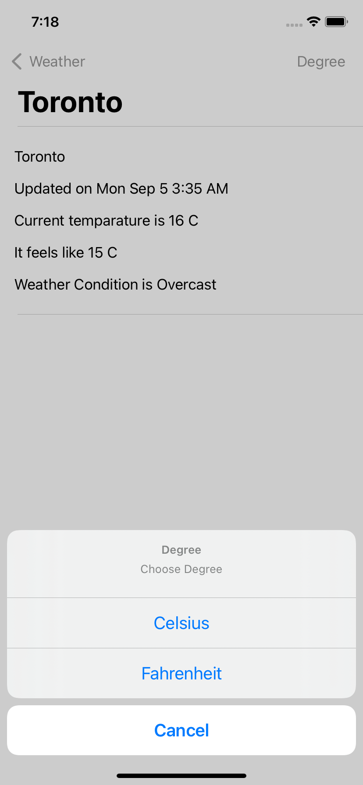
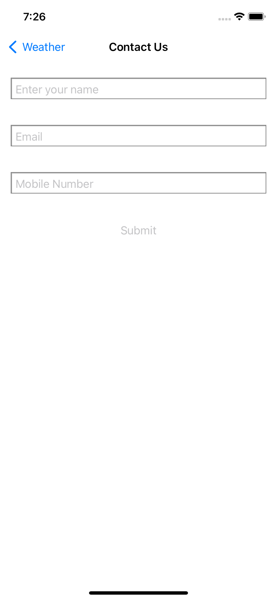
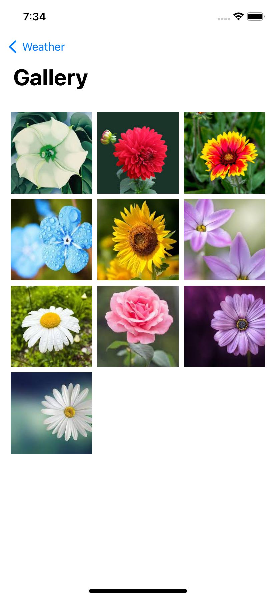

# *Weather iOS APP*
This app is build using Xcode version 13.4.1 and deployment target is iOS 15.0 and above.
## *How to run application*
1. Open `Weather.xcodeproj` file using above mentioned Xcode if that is not available use Xcode version 13 and above.
 2. Choose any iOS 15 and above simulator.
 3. Click run button or click `command+r` to run.  

## *Project architecture*

This iOS app uses VIP (View Interactor Presenter) architecture. This is also known as clean swift architecture. Basic control flow will be  

A simple example 
1. User interact with control elements on the view.
2. View asks Interactor to do something and displays a loading state on it.
3. When work completes Interactor ask presenter to display the result on view.
Here data flow is unidirectional you can read more about this on 
[clean swift architecture blog](https://clean-swift.com/).

## *Folder structure*
All the files are categorised into below folders 
1. Scenes 
2. Workers 
3. Services 
4. Models

You see same structure in unit tests as well

### *Scenes*

Scenes the name is self explanatory each screen or feature in the app is categorised as single scene folder. In our app we have the screens to display list of cities, weather details, contact us page and gallery. So our `Scenes` folder contains below sub folders.

Each subfolder contains all the files related to that scene. A normal scene contain View controller, Interactor, presenter, custom user interface views, table or collection view cells and router.

### *Models*

Models folder contains all the models related to the project. I have taken approach of creating enum for each scene for better redeability. This enum contain 3 `structs` 

1. `Request` - Request parameters that need to pass from view interactor to execute a task.
2. `Response` - This is normally API response object from remote server.
3. `ViewModel` - View model to display data on the view 

So incase of weather details we have an enum named `WeatherDetailsModel`. For me `WeatherDetailsModel.Request` makes more scene than `WeatherDetailsRequestModel`, same applies incase of ViewModel and Response objects. 

### *Workers*

Worker has a single responsibility to do it is either fetch response from an endpoint or save data into local storage.

Interactor depends heavily on workers, so instead of specifing concrete worker class we use protocols types inside interactor. We can easily modify or mock application functionnality using dependency injection now.

### *Services*

Services are data store classes so worker ask service to fetch the data from API or from local storage.

## *Application functionality*
### *Weather*
On Application launch user see list of cities, from there he can choose a city to check wheather details. 

Weather details looks like this

On the weather details screen user can change from Celsius to Fahrenheit 

### *Contact us*

On the home page we have a navigation button to contact customer support. As of now no networks class are implemented. 

You can enter your name, email and mobile number to get contacted. Local validation is implemented on this fields
Unless you enter valid input in all the fields Submit button is not enabled.

`User name` - Should contain only alphabets with atleast 4 characters length.
`Mobile number` - Should enter only numbers must be greater than 6 and less than 12.
`Email` - Must enter valid email address.

### *Gallery*

Gallery displays up to 10 images from local asset catalog. We can change this to choose images from your photo gallery in future.

On clicking on image it opens in a new screen where you can pinch and zoom. The transition between list screen to display image as of now if view controller push, we can improve this using custom transition easily as view is very loosely coupled with business logic.

# *Design consideration and future improvements*

1. Current user interface is very basic we can consider improving this.
2. In some places you can see empty structs is declared and pass between components these are for future usage.
3. All the string literals are declared in `Constants` and `Constants+Localisable` files. `Constants` contains all the non localisable strings i.e file names, etc. `Constants+Localisable` contains strings that are displayed to user. Since all these are in one place we can implement localisation easily in future. 
4. Since `Constants` does not contain any data other than string literals it is declared as local variable in almost all the files, I avoid using singleton objects. So you see each class has it own constats local instance.
6. Deployment target is iOS 15 because I am using some of the async await API which is only available iOS 15 or later. I know standard practice is to support last two versions of iOS. We can extend support for old versions in future.

I have written detailed inline comments in code, you can read them and understand more about this project.